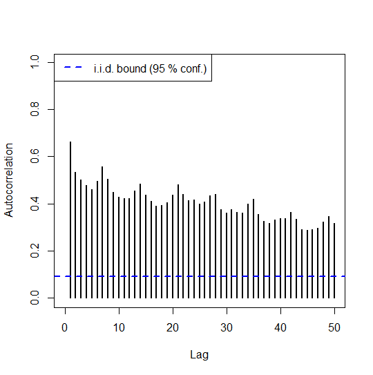

# fdaACF
Autocorrelation Function for Functional Time Series


#### *Guillermo Mestre Marcos, guillermo.mestre@comillas.edu*
#### *José Portela González, jose.portela@iit.comillas.edu*
#### *Antonio Muñoz San Roque, Antonio.Munoz@iit.comillas.edu*
#### *Estrella Alonso Pérez, ealonso@icai.comillas.edu*


<!-- badges: start -->
  [](https://travis-ci.org/GMestreM/fdaACF)
<!-- badges: end -->


This is the development repository for the fdaACF package. Functions within this package can be used for quantifying the serial correlation across lags of a given functional time series.


The current version of this package can be installed from Github:


```r
install.packages('devtools')
library(devtools)
install_github('GMestreM/fdaACF')
```

To install the stable version from CRAN, simply run the following from an R console:

```r
install.packages('fdaACF')
```

### Bug reports

Please submit any bug reports (or suggestions) using the [issues](https://github.com/GMestreM/fdaACF/issues) tab of the GitHub page.


### Functions

The main purpose of this package is identifying the underlying structure of a given functional time series. Functional data is expected as an `(m x p)` matrix, where `m` is the number of functional observations and `p` denotes the number of discretization points of each curve.


Start by loading the package and the sample dataset.


```r
library(fdaACF)
data(elec_prices)
matplot(t(elec_prices), type = "l",lty = 1,xlab = "Hours", ylab = "Price (€/MWh)")
```


<!-- -->


The `obtain_FACF` function estimates the lagged autocorrelation function for a given functional time series and its distribution under the hypothesis of strong functional white noise. The visual representation of the lagged ACF can be used to identify seasonal patterns in the functional data as well as auto-regressive or moving average terms. In addition, i.i.d. bounds are included to test the presence of serial correlation in the data.


```r
# Define the discretization axis
v <- seq(from = 1, to = 24)
nlags <- 50
ci <- 0.95

# Autocorrelation function for functional data
FACF <- obtain_FACF(Y = as.matrix(elec_prices), 
                    v = v,
                    nlags = nlags,
                    ci = ci,
                    figure = TRUE)
```


<!-- -->


The shape of the functional ACF indicates the presence of a daily seasonal effect in the data, as well as the presence of serial correlation.


The functional ACF is based on the L2 norm of the covariance functions of the data, which can be estimated with function `obtain_autocovariance` and plotted with function `plot_autocovariance`. In order to test the i.i.d. hypothesis, a functional white noise series will be simulated with function `simulate_iid_brownian_bridge`.


```r
# Simulate white noise series
N <- 400
v <- seq(from = 0, to = 1, length.out = 24)
sig <- 1
Y <- simulate_iid_brownian_bridge(N, v, sig)
matplot(t(Y), type = "l",lty = 1,xlab = "v", ylab = "", main = "Functional Brownian Bridge")
```

<!-- -->


```r
# Estimate the lagged covariance functions
nlags <- 4
lagged_autocov <- obtain_autocovariance(Y = Y,nlags = nlags)


# Plot lagged covariance functions
par(mfrow = c(1,5))
for(k in 0:nlags){
   plot_autocovariance(lagged_autocov,k)
}
par(mfrow = c(1,1))

```


<!-- -->


As illustrated by the previous image, the L2 norm of these covariance surfaces is close to 0. This can be easily checked by obtaining the ACF function of these data.


```r
# Autocorrelation function for functional data
FACF_iid <- obtain_FACF(Y = Y, 
                        v = v,
                        nlags = 30,
                        ci = ci,
                        figure = TRUE)
```


<!-- -->


As all the autocorrelation values fall below the i.i.d. bound, the i.i.d. hypothesis cannot be rejected.


### License

This package is released in the public domain under the General Public License [GPL](https://www.gnu.org/licenses/gpl-3.0.en.html). 

### Association
Package created in the Institute for Research in Technology (IIT), [link to homepage](https://www.iit.comillas.edu/index.php.en) 
